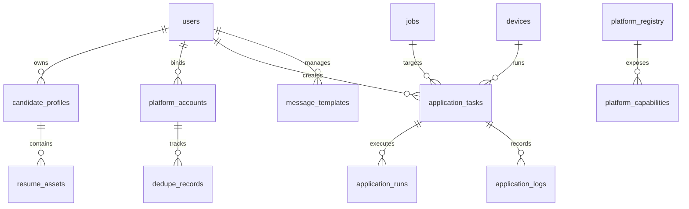

# 数据库表设计

## 1. 设计目标

这套表结构要同时支持：

- Boss Android App
- Boss 网页版
- 后续其他招聘平台
- 沟通型动作和投递型动作

所以表结构重点不应该只围绕“投递记录”，而要围绕：

- 平台
- 设备
- 职位
- 动作任务
- 执行过程
- 消息模板
- 去重与频控

---

## 2. 核心实体关系

---

## 3. 建议表

### `users`

| 字段 | 类型 | 说明 |
|---|---|---|
| `id` | uuid pk | 用户 ID |
| `email` | varchar(255) | 登录邮箱 |
| `phone` | varchar(32) | 手机号 |
| `display_name` | varchar(128) | 展示名 |
| `created_at` | timestamptz | 创建时间 |
| `updated_at` | timestamptz | 更新时间 |

### `candidate_profiles`

| 字段 | 类型 | 说明 |
|---|---|---|
| `id` | uuid pk | 简历档案 ID |
| `user_id` | uuid fk | 所属用户 |
| `name` | varchar(64) | 档案名 |
| `headline` | varchar(255) | 简要标题 |
| `base_info` | jsonb | 姓名、教育、经历等结构化信息 |
| `availability_date` | date | 最快到岗时间 |
| `preferred_roles` | jsonb | 目标岗位 |
| `created_at` | timestamptz | 创建时间 |
| `updated_at` | timestamptz | 更新时间 |

### `resume_assets`

| 字段 | 类型 | 说明 |
|---|---|---|
| `id` | uuid pk | 附件 ID |
| `profile_id` | uuid fk | 所属档案 |
| `asset_type` | varchar(32) | `resume_pdf` / `portfolio` |
| `file_name` | varchar(255) | 文件名 |
| `storage_key` | varchar(512) | 对象存储路径 |
| `mime_type` | varchar(128) | 文件类型 |
| `is_default` | boolean | 是否默认 |
| `created_at` | timestamptz | 创建时间 |

### `platform_registry`

| 字段 | 类型 | 说明 |
|---|---|---|
| `id` | uuid pk | 平台记录 ID |
| `platform_code` | varchar(64) unique | 如 `boss_android` |
| `platform_name` | varchar(128) | 平台名称 |
| `platform_family` | varchar(64) | 如 `boss` / `zhilian` |
| `platform_type` | varchar(32) | `android_app` / `web` / `ios_app` |
| `adapter_code` | varchar(128) | 绑定 adapter |
| `is_active` | boolean | 是否启用 |
| `health_status` | varchar(32) | `healthy` / `degraded` / `disabled` |
| `last_verified_at` | timestamptz | 最近验证时间 |

唯一约束建议：

- `uk_platform_registry_platform_code(platform_code)`

### `platform_capabilities`

| 字段 | 类型 | 说明 |
|---|---|---|
| `id` | uuid pk | 能力记录 ID |
| `platform_id` | uuid fk | 所属平台 |
| `capability_code` | varchar(64) | 如 `start_chat` |
| `is_supported` | boolean | 是否支持 |
| `requires_manual_review` | boolean | 是否需人工确认 |
| `notes` | text | 说明 |

唯一约束建议：

- `uk_platform_capabilities(platform_id, capability_code)`

### `platform_accounts`

| 字段 | 类型 | 说明 |
|---|---|---|
| `id` | uuid pk | 平台账号 ID |
| `user_id` | uuid fk | 所属用户 |
| `platform_code` | varchar(64) | 平台编码 |
| `account_label` | varchar(128) | 账号备注 |
| `login_identifier` | varchar(255) | 登录标识 |
| `session_source` | varchar(32) | `local_device` / `imported_session` |
| `status` | varchar(32) | `active` / `paused` / `risk` |
| `created_at` | timestamptz | 创建时间 |
| `updated_at` | timestamptz | 更新时间 |

### `devices`

| 字段 | 类型 | 说明 |
|---|---|---|
| `id` | uuid pk | 设备 ID |
| `device_code` | varchar(64) unique | 设备编码 |
| `platform_type` | varchar(32) | `android_app` / `web` |
| `device_name` | varchar(128) | 设备名称 |
| `adb_serial` | varchar(128) | Android 序列号 |
| `status` | varchar(32) | `idle` / `busy` / `offline` |
| `capabilities` | jsonb | 分辨率、系统版本等 |
| `last_seen_at` | timestamptz | 最近在线时间 |

### `jobs`

| 字段 | 类型 | 说明 |
|---|---|---|
| `id` | uuid pk | 职位 ID |
| `platform_code` | varchar(64) | 平台编码 |
| `external_job_id` | varchar(128) | 平台侧职位 ID |
| `title` | varchar(255) | 岗位名称 |
| `company_name` | varchar(255) | 公司名 |
| `city` | varchar(128) | 城市 |
| `salary_text` | varchar(128) | 薪资原文 |
| `recruiter_name` | varchar(128) | 招聘者名 |
| `recruiter_id` | varchar(128) | 招聘者标识 |
| `job_url` | text | 网页 URL |
| `job_snapshot` | jsonb | 职位快照 |
| `created_at` | timestamptz | 首次入库时间 |
| `updated_at` | timestamptz | 更新时间 |

索引建议：

- `idx_jobs_platform_external(platform_code, external_job_id)`
- `idx_jobs_company_title(company_name, title)`

### `message_templates`

| 字段 | 类型 | 说明 |
|---|---|---|
| `id` | uuid pk | 模板 ID |
| `user_id` | uuid fk | 所属用户 |
| `platform_code` | varchar(64) | 平台编码 |
| `scene_code` | varchar(64) | `start_chat` / `follow_up` |
| `title` | varchar(128) | 模板名 |
| `template_text` | text | 模板内容 |
| `variables` | jsonb | 模板变量 |
| `is_active` | boolean | 是否启用 |
| `created_at` | timestamptz | 创建时间 |
| `updated_at` | timestamptz | 更新时间 |

### `application_tasks`

| 字段 | 类型 | 说明 |
|---|---|---|
| `id` | uuid pk | 任务 ID |
| `user_id` | uuid fk | 所属用户 |
| `platform_account_id` | uuid fk | 平台账号 |
| `profile_id` | uuid fk | 简历档案 |
| `device_id` | uuid fk | 执行设备 |
| `job_id` | uuid fk | 目标职位 |
| `platform_code` | varchar(64) | 平台编码 |
| `platform_type` | varchar(32) | 执行端类型 |
| `action_type` | varchar(64) | `start_chat` / `send_resume` |
| `status` | varchar(32) | 当前状态 |
| `priority` | int | 优先级 |
| `payload` | jsonb | 执行参数 |
| `requires_manual_review` | boolean | 是否人工确认 |
| `scheduled_at` | timestamptz | 计划执行时间 |
| `created_at` | timestamptz | 创建时间 |
| `updated_at` | timestamptz | 更新时间 |

索引建议：

- `idx_tasks_user_status(user_id, status)`
- `idx_tasks_device_status(device_id, status)`
- `idx_tasks_schedule(status, scheduled_at)`

### `application_runs`

| 字段 | 类型 | 说明 |
|---|---|---|
| `id` | uuid pk | 执行记录 ID |
| `task_id` | uuid fk | 关联任务 |
| `driver_type` | varchar(32) | `playwright` / `appium` |
| `adapter_code` | varchar(128) | adapter 名 |
| `started_at` | timestamptz | 开始时间 |
| `finished_at` | timestamptz | 结束时间 |
| `result` | varchar(32) | `succeeded` / `failed` / `blocked` |
| `error_code` | varchar(64) | 错误码 |
| `error_message` | text | 错误信息 |
| `screenshot_urls` | jsonb | 截图路径 |
| `trace_url` | text | 回放或 trace 地址 |
| `raw_output` | jsonb | 原始执行结果 |

### `application_logs`

| 字段 | 类型 | 说明 |
|---|---|---|
| `id` | uuid pk | 日志 ID |
| `task_id` | uuid fk | 关联任务 |
| `run_id` | uuid fk | 关联执行记录 |
| `level` | varchar(16) | `info` / `warn` / `error` |
| `event_type` | varchar(64) | `screen_detected` 等 |
| `message` | text | 日志消息 |
| `details` | jsonb | 附加数据 |
| `created_at` | timestamptz | 创建时间 |

### `dedupe_records`

| 字段 | 类型 | 说明 |
|---|---|---|
| `id` | uuid pk | 去重记录 ID |
| `user_id` | uuid fk | 所属用户 |
| `platform_code` | varchar(64) | 平台编码 |
| `recruiter_id` | varchar(128) | 招聘者标识 |
| `job_id` | uuid fk | 关联职位 |
| `action_type` | varchar(64) | 动作类型 |
| `dedupe_key` | varchar(255) | 去重键 |
| `last_executed_at` | timestamptz | 最近执行时间 |

唯一约束建议：

- `uk_dedupe_records(dedupe_key)`

### `manual_reviews`

| 字段 | 类型 | 说明 |
|---|---|---|
| `id` | uuid pk | 审核 ID |
| `task_id` | uuid fk | 对应任务 |
| `review_reason` | varchar(128) | 审核原因 |
| `review_payload` | jsonb | 待确认内容 |
| `decision` | varchar(32) | `pending` / `approved` / `rejected` |
| `reviewed_at` | timestamptz | 审核时间 |

---

## 4. 第一版最小必需表

如果你想先快起 MVP，第一批只落下面这些表就够：

- `users`
- `candidate_profiles`
- `resume_assets`
- `platform_registry`
- `devices`
- `jobs`
- `message_templates`
- `application_tasks`
- `application_runs`
- `dedupe_records`

---

## 5. 索引与约束建议

### 去重相关

- `application_tasks(platform_code, action_type, status)`
- `dedupe_records(dedupe_key unique)`

### 调度相关

- `application_tasks(status, scheduled_at)`
- `application_tasks(device_id, status)`

### 平台查询相关

- `jobs(platform_code, external_job_id)`
- `platform_registry(platform_code unique)`

---

## 6. 迁移顺序建议

建议 Alembic 迁移顺序：

1. `users`
2. `candidate_profiles`
3. `resume_assets`
4. `platform_registry`
5. `platform_capabilities`
6. `platform_accounts`
7. `devices`
8. `jobs`
9. `message_templates`
10. `application_tasks`
11. `application_runs`
12. `application_logs`
13. `dedupe_records`
14. `manual_reviews`

