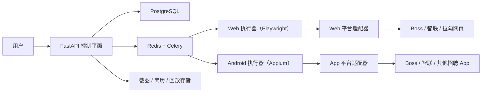

# 招聘平台自动沟通与投递系统技术方案（Python 版）

## 1. 背景与目标

目标不是只做“网页投简历”，而是做一个能跨 **招聘网站 + 招聘 App** 运行的自动化系统。

从你给的 Boss 直聘界面看，当前最真实的 MVP 场景其实是：

- 在职位列表中进入职位详情
- 点击 `立即沟通`
- 进入聊天页
- 发送预设首句
- 按需发送简历

所以这套系统的核心目标应该改成：

- 自动进入职位页
- 自动触发 `立即沟通` / `投递简历` / `发送简历`
- 自动发送首句或问候模板
- 遇到验证码、风控、异常弹窗时转人工
- 每次动作都有日志、截图、状态回放

这类产品本质上是一个 **控制平面 + 多端执行器 + 平台适配器** 系统，而不是单纯的爬虫或脚本。

---

## 2. 推荐总体架构

### 2.1 方案

推荐采用 **“Python 后端 + Web 执行器 + Android App 执行器 + 平台适配器”** 的混合架构。

### 2.2 为什么这样改

你现在的 Boss 直聘流程来自移动端 App 界面，而不是浏览器网页。  
这意味着原来以 `Chrome 扩展 + Playwright` 为中心的方案不够用了，至少要升级成下面这种分层：

1. **控制平面**
   - 统一管理任务、模板、简历、日志、状态、限流
2. **Web 执行器**
   - 处理 Boss 网页版、智联网页版、拉勾网页版这类页面自动化
3. **Android App 执行器**
   - 处理 Boss 直聘 App、其他招聘 App 的原生界面自动化
4. **平台适配器**
   - 每个平台一套规则，但对上层暴露统一动作接口

如果后期你会继续接入其他招聘软件，这种架构会比“给每个平台单独写一堆脚本”稳得多。

---

## 3. 推荐技术栈

### 3.1 后端控制平面

- **Python 3.11+**
- **FastAPI**
  - 提供 REST API、WebSocket、任务回调
- **Pydantic v2**
  - 统一数据模型和校验
- **SQLAlchemy 2 + Alembic**
  - ORM 与迁移

### 3.2 Web 执行器

- **Playwright Python**
  - 负责网页职位页识别、按钮点击、表单填写、文件上传

### 3.3 Android App 执行器

- **Appium Python Client**
  - 统一 Android 原生 App 自动化控制
- **Appium UiAutomator2 Driver**
  - 作为 Android 自动化驱动
- **ADB**
  - 设备连接、调试、截图、安装、日志辅助

说明：

- 如果你的核心目标是 **Boss 直聘 App 自动点击“立即沟通”**，那 Appium 这一层是必须的。
- `Chrome 扩展` 可以保留，但降级为“网页辅助入口”，不再是系统主轴。

### 3.4 异步任务

- **Redis + Celery**
  - 任务队列、延迟执行、失败重试、并发控制

### 3.5 数据存储

- **PostgreSQL**
  - 存用户配置、简历、职位、平台账号、任务、日志、适配器配置
- **JSONB**
  - 存平台特有字段、页面结构快照、聊天模板、动作结果
- **对象存储（MinIO / S3 / OSS）**
  - 存截图、录像、简历 PDF、执行产物

### 3.6 可选增强

- **OCR**
  - 识别截图中的风控提示、弹窗文案、异常提示
- **LLM / 规则引擎**
  - 生成首句模板、回答常见问题、做岗位匹配
- **Sentry / OpenTelemetry**
  - 异常追踪、链路监控

---

## 4. 系统分层架构



---

## 5. 核心设计原则

### 5.1 平台无关的动作抽象

不要把系统设计成“某个页面点某个按钮”的纯脚本集合，而是统一抽象成标准动作。

建议标准动作：

- `open_job`
- `start_chat`
- `send_greeting`
- `send_resume`
- `submit_application`
- `follow_up`
- `mark_not_interested`

这样 Boss 直聘里叫 `立即沟通`，其他软件里叫 `聊一聊`、`立即投递`、`打招呼`，都能映射到统一动作。

### 5.2 驱动层与适配器层分离

建议拆成两层：

1. **Driver**
   - 只负责“看见元素、点击、输入、截图、滑动、等待”
2. **Adapter**
   - 负责“这一步该点哪个按钮、什么时候算成功、异常怎么处理”

这样后期接更多招聘软件时，复用率会高很多。

### 5.3 能力矩阵先行

每个平台都不要默认“全量支持”，而是维护能力矩阵：

- 是否支持职位抓取
- 是否支持立即沟通
- 是否支持发送简历
- 是否支持自动首句
- 是否支持已沟通过去重
- 是否支持聊天页二次跟进

这个能力矩阵建议直接进数据库，而不是写死在代码里。

---

## 6. 核心模块设计

### 6.1 用户与简历中心

职责：

- 管理多份简历版本
- 管理基础资料：姓名、电话、邮箱、教育、项目、经历
- 管理附件：PDF 简历、作品集、求职信
- 管理平台级覆盖字段

### 6.2 首句与消息模板中心

这是当前 Boss 直聘场景必须补的一层。

职责：

- 管理不同平台的开场白模板
- 按岗位类型选择不同首句
- 支持变量填充，例如岗位名、技术栈、到岗时间
- 控制消息长度和敏感词

示例模板字段：

- `platform_code`
- `scene_code`
- `message_template`
- `send_after_start_chat`
- `requires_manual_confirm`

### 6.3 职位发现与筛选

职责：

- 从网页列表页或 App 列表页收集职位
- 过滤黑名单公司、重复岗位、低匹配岗位
- 保留职位快照，避免页面变化后失真

### 6.4 沟通/投递任务编排

职责：

- 将“想投的岗位”转换成标准任务
- 控制优先级、并发、失败重试、平台限速
- 判断当前任务是 `立即沟通` 还是 `直接投递`

建议任务类型：

- `job_browse`
- `start_chat`
- `send_resume`
- `submit_application`
- `follow_up_chat`

建议任务状态：

- `draft`
- `queued`
- `running`
- `waiting_manual_review`
- `succeeded`
- `failed`
- `blocked`
- `skipped_duplicate`

### 6.5 平台适配器

这是最核心的模块，必须做成插件化。

建议按 “平台 + 端” 拆分：

- `boss_android_adapter`
- `boss_web_adapter`
- `zhilian_android_adapter`
- `zhilian_web_adapter`

每个 adapter 负责：

- 页面/界面识别
- 职位信息解析
- 动作按钮定位
- 首句发送
- 简历发送
- 成功态识别
- 风控/异常识别

接口示意：

```python
from typing import Protocol

class PlatformAdapter(Protocol):
    platform_code: str
    platform_type: str  # web / android_app

    async def detect_screen(self) -> str: ...
    async def parse_job(self) -> dict: ...
    async def open_job(self) -> None: ...
    async def start_chat(self) -> dict: ...
    async def send_greeting(self, message: str) -> dict: ...
    async def send_resume(self, resume_id: str) -> dict: ...
    async def submit_application(self) -> dict: ...
    async def is_duplicate_contact(self) -> bool: ...
    async def detect_risk_prompt(self) -> dict: ...
```

### 6.6 Driver 层

建议单独抽象两类 driver：

#### WebDriver

- 基于 Playwright
- 支持点击、输入、上传、等待、截图、录制

#### AndroidDriver

- 基于 Appium
- 支持点击、输入、滑动、返回、截图、元素查找
- 支持按文本、resource-id、content-desc、层级路径定位

### 6.7 执行引擎

职责：

- 接收标准任务
- 选择对应 driver 与 adapter
- 执行动作链
- 保存截图、日志、回放、结果

关键点：

- 一个设备或浏览器实例一次只跑有限任务
- 强制限流，避免账号异常
- 每一步都有可回溯日志

### 6.8 去重与频控模块

这是后面支持多招聘软件时特别关键的一层。

职责：

- 防止同一岗位重复沟通
- 防止同一招聘者反复发送首句
- 控制单日平台触发次数
- 控制每个平台的节奏

建议去重键：

- `platform_code + recruiter_id + job_id`
- `platform_code + company_name + job_title + city`

### 6.9 人工审核模块

第一版必须保留。

职责：

- 展示待确认任务
- 展示系统识别结果
- 展示即将发送的首句
- 展示风险提示和截图
- 允许一键确认或中止

---

## 7. Boss 直聘 MVP 流程

根据你给的界面，第一版建议只做下面这条最短闭环：

1. 进入 Boss 职位列表
2. 点击目标职位卡片
3. 进入职位详情页
4. 点击 `立即沟通`
5. 进入聊天页
6. 自动发送预设首句
7. 记录成功截图与时间

第一版先不要追求：

- 自动多轮对话
- 自动换微信
- 自动拨号
- 自动投所有岗位

先把 `点职位 -> 点立即沟通 -> 发首句` 这条链路跑稳。

---

## 8. 为后续增加其他招聘软件需要补的设计

### 8.1 平台注册中心

建议新增 `platform_registry` 概念，维护：

- 平台编码
- 平台类型（web / android_app / ios_app）
- 适配器类名
- 支持动作
- 当前健康状态
- 最近验证时间

### 8.2 页面/界面状态机

不同平台界面文案不同，但都可以抽象成状态机：

- `job_list`
- `job_detail`
- `chat_room`
- `resume_popup`
- `risk_popup`
- `unknown`

这样新增平台时，不用重写整个调度器。

### 8.3 选择器策略仓库

不要把所有定位规则散落在代码里。

建议把这些信息配置化：

- 元素文本
- resource-id
- class name
- XPath 或层级定位
- 备用定位规则

### 8.4 能力回归测试

后期每接一个新平台，都要能回归验证：

- 能否打开职位
- 能否点沟通按钮
- 能否发送首句
- 能否识别已沟通过
- 能否在异常弹窗时退出

---

## 9. 数据模型建议

### 9.1 核心表

- `users`
- `candidate_profiles`
- `resume_assets`
- `platform_accounts`
- `platform_registry`
- `platform_capabilities`
- `jobs`
- `application_tasks`
- `application_runs`
- `application_logs`
- `message_templates`
- `dedupe_records`
- `manual_reviews`

### 9.2 关键字段建议

`application_tasks`

- `id`
- `user_id`
- `platform_code`
- `platform_type`
- `job_id`
- `job_url`
- `action_type`
- `status`
- `priority`
- `device_id`
- `requires_manual_review`
- `scheduled_at`

`application_runs`

- `id`
- `task_id`
- `driver_type`
- `adapter_code`
- `started_at`
- `finished_at`
- `result`
- `error_code`
- `error_message`
- `screenshot_urls`
- `trace_url`

`message_templates`

- `id`
- `platform_code`
- `scene_code`
- `title`
- `template_text`
- `is_active`

`dedupe_records`

- `id`
- `platform_code`
- `recruiter_id`
- `job_id`
- `action_type`
- `last_executed_at`

---

## 10. 技术难点与应对

### 10.1 当前文档最大问题

原文档默认你在操作网页，这和你现在的 Boss App 场景不一致。  
所以最需要修改的地方不是小修小补，而是把“执行入口”从单一网页升级成“网页 + Android App”双通道。

### 10.2 App 界面变化频繁

应对：

- 文本定位 + resource-id 定位双保险
- 保留多套备用选择器
- 保存失败截图

### 10.3 分辨率与机型差异

应对：

- 尽量不用绝对坐标点击
- 以元素定位为主
- 保留滚动和兜底识别逻辑

### 10.4 平台风控

应对：

- 控制频率
- 保留人工确认
- 首句模板多样化
- 检测风险弹窗立即暂停

### 10.5 多平台维护成本高

应对：

- Adapter 插件化
- Driver 统一封装
- 平台能力矩阵化

---

## 11. 推荐开发阶段

### Phase 1: Boss Android MVP

目标：

- 只支持 Boss 直聘 Android App
- 只做 `点职位 -> 点立即沟通 -> 发首句`
- 有人工确认开关

交付：

- FastAPI
- PostgreSQL
- Redis + Celery
- Appium Android 执行器
- Boss Android Adapter
- 首句模板中心

### Phase 2: Boss 完整流程

目标：

- 支持发送简历
- 支持已沟通过去重
- 支持失败重试和日志回放

### Phase 3: 多平台扩展

目标：

- 增加智联、拉勾、前程无忧等平台
- 同时支持网页端和 App 端
- 建立平台能力矩阵和回归测试

---

## 12. 最终建议

如果你的真实目标是 Boss 直聘这类场景，我建议把路线定成：

- **控制平面：Python + FastAPI**
- **任务队列：Redis + Celery**
- **数据库：PostgreSQL**
- **网页端执行：Playwright Python**
- **Android App 执行：Appium Python + UiAutomator2 + ADB**
- **文件存储：MinIO / S3**

也就是说：

- 如果是网页招聘站，用 Playwright
- 如果是 Android 招聘 App，用 Appium
- 两者共用同一个后端、任务系统和平台适配器规范

这才是真正适合“后面还要接更多招聘软件”的架构。

---

## 13. 参考资料

- FastAPI: https://fastapi.tiangolo.com/
- Playwright Python: https://playwright.dev/python/docs/intro
- Appium Python Quickstart: https://appium.io/docs/en/latest/quickstart/test-py/
- Appium UiAutomator2 Driver: https://appium.github.io/appium.io/docs/en/drivers/android-uiautomator2/
- Android Debug Bridge (ADB): https://developer.android.com/tools/adb
- Celery: https://docs.celeryq.dev/
- PostgreSQL JSON:
  - https://www.postgresql.org/docs/current/datatype-json.html
  - https://www.postgresql.org/docs/current/functions-json.html
